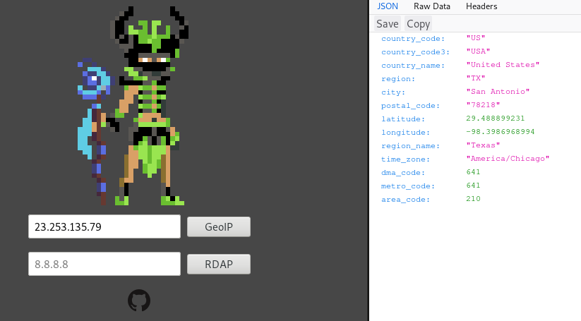

# ipshaman

This is an IP address information gathering utility. The ipshaman web server, client API, and command-line tool all currently live in this repo.

## Usage

ipshaman is easy to use from the command-line using curl:

```
$ dig +short python.org
23.253.135.79

$ curl ipshaman/23.253.135.79
{
  "area_code": 210,
  "city": "San Antonio",
  "country_code": "US",
  "country_code3": "USA",
  "country_name": "United States",
  "dma_code": 641,
  "ip": "23.253.135.79",
  "latitude": 29.48889923095703,
  "longitude": -98.39869689941406,
  "metro_code": 641,
  "postal_code": "78218",
  "region": "TX",
  "region_name": "Texas",
  "time_zone": "America/Chicago"
}
```

ipshaman also has a complete command-line utility with some special features!

Install the ipshaman CLI easily with: `pip install ipshaman`

```
$ ipshaman --help
usage: ipshaman.py [-h] [-s SERVER] [-l LOOKUP] [-i INPUT] [-f] [-v]

ipshaman cli

optional arguments:
  -h, --help            show this help message and exit
  -s SERVER, --server SERVER
                        ipshaman domain or IP to use
  -l LOOKUP, --lookup LOOKUP
                        specify an IP address
  -i INPUT, --input INPUT
                        specify an input file containing IP addresses
  -f, --force           force input file to process
  -v, --version         displays the current version of ipshaman

$ ipshaman --lookup 23.253.135.79
{'country_code': 'US', 'country_code3': 'USA', ... }

$ ipshaman --input ipshaman/inputs/list_of_ips_short.txt
{'ip': '244.36.171.60', 'error': 'INVALID_IP'}
{'country_code': 'ES', 'country_code3': 'ESP', 'country_name': 'Spain', 'region': '58', ... }
{'country_code': 'NL', 'country_code3': 'NLD', 'country_name': 'Netherlands', 'region': '07', ... }
...
```

ipshaman can also be used easily within Python code:

```python
>>> import ipshaman
>>> c = ipshaman.Client()
>>> c.lookup('23.253.135.79')
{'country_code': 'US', 'country_code3': 'USA', ... }
```

ipshaman also has a primitive web interface.



## I want to run my own ipshaman server!

ipshaman has been tested with Debian 9.5, here's how to get up and running:

```
# apt-get update && apt-get install -y git
# git clone https://github.com/vesche/ipshaman
# cd ipshaman/ipshaman-server
# bash install.sh
```

Once installed, ipshaman can be administered using systemd:

```
$ sudo systemctl status ipshaman
 ipshaman.service - ipshaman
   Loaded: loaded (/lib/systemd/system/ipshaman.service; enabled; vendor preset: enabled)
   Active: active (running) since Wed 2018-08-01 01:21:29 UTC; 20min ago
 Main PID: 9023 (python3.5)
    Tasks: 8 (limit: 4915)
   CGroup: /system.slice/ipshaman.service
           9023 /usr/bin/python3.5 /opt/ipshaman-server/server.py

Aug 01 01:21:29 debian systemd[1]: Stopped ipshaman.
Aug 01 01:21:29 debian systemd[1]: Started ipshaman.
Aug 01 01:21:30 debian python3.5[9023]: [2018-08-01 01:21:30 +0000] [9023] [INFO] Goin' Fast @ http://0.0.0.0:80
Aug 01 01:21:30 debian python3.5[9023]: [2018-08-01 01:21:30 +0000] [9023] [INFO] Starting worker [9023]
```

Specify your own server like so:

```
$ ipshaman --server localhost:8000 --lookup 23.253.135.79
{"country_code":"US","country_code3":"USA", ... }
```

```python
>>> import ipshaman
>>> c = ipshaman.Client('localhost:8000')
>>> c.lookup('23.253.135.79')
{'country_code': 'US', 'country_code3': 'USA', ... }
```

Also, note that the server will host on `0.0.0.0:8000` by default.
